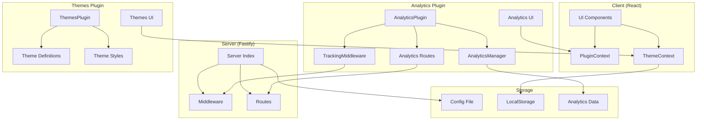
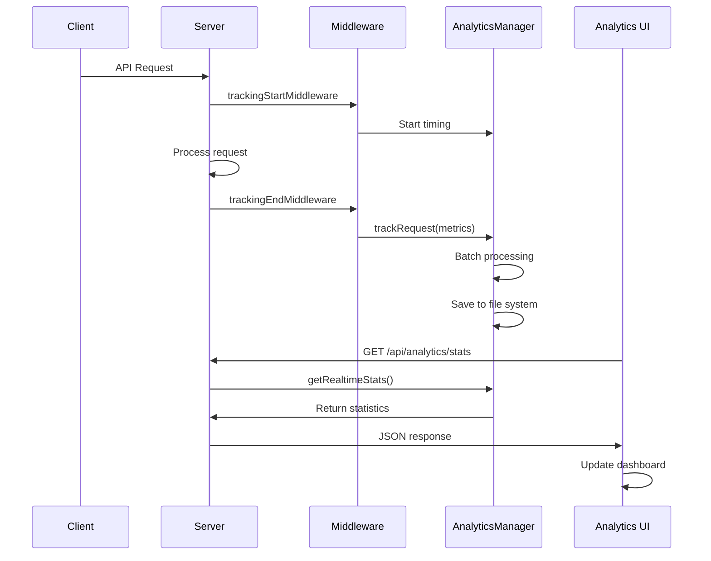
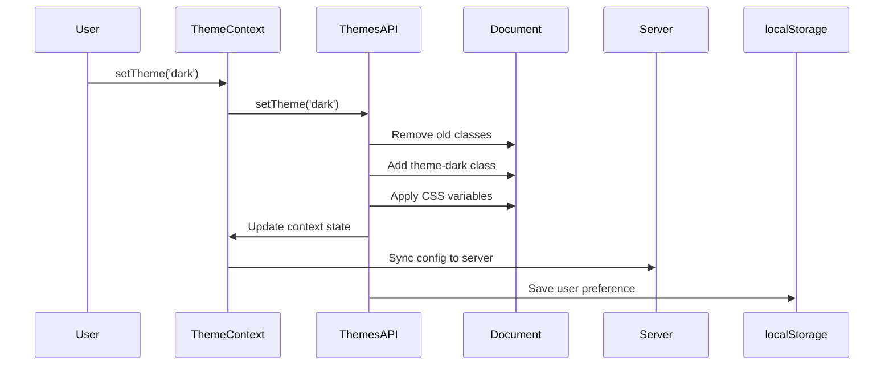

# 📋 ANALIZA COMPLETĂ PLUGINURI CLAUDE CODE ROUTER

> **Data analizei**: 2025-09-07  
> **Versiune analizată**: Claude Code Router v1.x  
> **Pluginuri analizate**: Analytics și Themes  
> **Status**: Documentație completă și detaliată  

---

## 📑 CUPRINS

1. [Prezentare Generală](#-prezentare-generală)
2. [Arhitectura Pluginurilor](#-arhitectura-pluginurilor)
3. [Plugin Analytics](#-plugin-analytics)
4. [Plugin Themes](#-plugin-themes)
5. [Puncte de Integrare](#-puncte-de-integrare)
6. [Configurații](#-configurații)
7. [Mecanisme de Funcționare](#-mecanisme-de-funcționare)
8. [API și Interfețe](#-api-și-interfețe)
9. [Exemple de Utilizare](#-exemple-de-utilizare)
10. [Diagrame de Structură](#-diagrame-de-structură)

---

## 🎯 PREZENTARE GENERALĂ

Claude Code Router implementează un **sistem de pluginuri modular** care permite extinderea funcționalității aplicației prin componente independente. Sistemul include în prezent **2 pluginuri principale**:

### **📊 Plugin Analytics**
- **Scop**: Monitorizare în timp real, statistici și Mission Control dashboard
- **Caracteristici**: Tracking cereri, metrici provider, analize de performanță
- **Componente**: Manager, middleware, rute API, componente UI

### **🎨 Plugin Themes**
- **Scop**: Sistem unificat de teme vizuale (Light, Dark, Advanced)
- **Caracteristici**: Glassmorphism, animații, persistență setări
- **Componente**: Context React, selector UI, stiluri CSS

---

## 🏗️ ARHITECTURA PLUGINURILOR

### Structura Generală

```
/plugins/
├── analytics/                    # Plugin Analytics
│   ├── index.ts                 # Entry point și clasa plugin
│   ├── manager.ts               # Manager central de date
│   ├── types.ts                 # Interfețe TypeScript
│   ├── middleware/              # Middleware de tracking
│   │   └── tracking.ts
│   ├── routes/                  # API endpoints
│   │   ├── analytics.ts
│   │   └── mission-control.ts
│   └── ui/                      # Componente React
│       ├── AnalyticsButton.tsx
│       ├── AnalyticsSettings.tsx
│       ├── components/
│       ├── contexts/
│       ├── hooks/
│       ├── lib/
│       └── types/
│
└── themes/                      # Plugin Themes
    ├── index.ts                 # Plugin API și implementare
    ├── types/index.ts           # Interfețe TypeScript
    ├── components/              # Componente React
    │   └── ThemeSelector.tsx
    ├── contexts/                # Context React
    │   └── ThemeContext.tsx
    ├── styles/                  # Stiluri CSS
    │   ├── themes.css
    │   ├── variables.css
    │   ├── components.css
    │   └── modern-effects.css
    └── ui/                      # Componente UI
        └── ThemeSettings.tsx
```

### Principii de Design

1. **Modularitate**: Fiecare plugin este complet independent
2. **Plugin API**: Interfață comună pentru toate pluginurile  
3. **React Integration**: Hook-uri și contexte pentru integrare UI
4. **Server Integration**: Middleware și rute API pentru backend
5. **Configurabilitate**: Setări flexibile prin config.json

---

## 📊 PLUGIN ANALYTICS

### 📋 Structura Detaliată

#### **Fișiere Principale**

| Fișier | Scop | Componente Cheie |
|--------|------|------------------|
| `index.ts` | Entry point plugin | `AnalyticsPlugin` class |
| `manager.ts` | Manager central date | `AnalyticsManager` class |
| `types.ts` | Interfețe TypeScript | `AnalyticsPluginConfig`, `RequestMetrics` |

#### **Middleware și Rute**

| Fișier | Functionalitate |
|--------|----------------|
| `middleware/tracking.ts` | Tracking cereri in timp real |
| `routes/analytics.ts` | API endpoints pentru statistici |
| `routes/mission-control.ts` | API pentru Mission Control |

#### **Componente UI**

```
ui/
├── AnalyticsButton.tsx          # Buton acces rapid analytics
├── AnalyticsSettings.tsx        # Panel setări plugin
├── components/
│   └── dashboard/
│       └── tabs/
│           └── MissionControlTab.tsx  # Tab principal dashboard
├── contexts/
│   ├── MissionControlContext.tsx      # Context pentru MC
│   └── ProviderManagerContext.tsx     # Context provideri
├── hooks/
│   ├── useApiPolling.ts              # Hook polling API
│   ├── useMissionControl.ts          # Hook logic MC
│   ├── useMissionControlData.ts      # Hook date MC
│   └── useProviderManager.ts         # Hook managemenet provideri
├── lib/
│   ├── analytics.ts                  # Utilități analytics
│   └── missionControlAPI.ts          # API client MC
└── types/
    ├── dashboard.ts                  # Tipuri dashboard
    └── missionControl.ts             # Tipuri Mission Control
```

### 🔧 Funcționalități Principale

#### **1. Tracking Cereri**
- **Middleware**: `trackingStartMiddleware` și `trackingEndMiddleware`
- **Metrici**: Response time, status codes, token usage, cost
- **Batch Processing**: Optimizare pentru performanță
- **Data Retention**: Configurabil (implicit 30 zile)

#### **2. Analiză Performanță**
- **Provider Health**: Monitoring stare provideri
- **Route Efficiency**: Analiză performanță rute
- **Time Series Data**: Date istorice pentru grafice
- **Real-time Stats**: Statistici live

#### **3. Mission Control Dashboard**
- **Provider Overview**: Status și metrici provideri
- **Request Analytics**: Analiză cereri în timp real
- **Cost Tracking**: Monitorizare costuri
- **Error Monitoring**: Detectare și analiza erorilor

### 📈 Structura Datelor

#### **RequestMetrics Interface**
```typescript
interface RequestMetrics {
  id: string;
  timestamp: number;
  model: string;
  provider: string;
  endpoint: string;
  method: string;
  statusCode: number;
  responseTime: number;
  tokenCount?: number;
  inputTokens?: number;
  outputTokens?: number;
  cost?: number;
  userAgent?: string;
  ipAddress?: string;
  error?: string;
  route?: string;           // Route used
  originalModel?: string;   // Original model requested
  actualModel?: string;     // Actual model used after routing
}
```

### ⚙️ Configurație Analytics

```json
{
  "plugins": {
    "analytics": {
      "enabled": true,
      "batchSize": 10,
      "saveFrequency": 5000,
      "enableRealTimeUpdates": true,
      "dataRetentionDays": 30
    }
  }
}
```

---

## 🎨 PLUGIN THEMES

### 📋 Structura Detaliată

#### **Fișiere Principale**

| Fișier | Scop | Componente Cheie |
|--------|------|------------------|
| `index.ts` | Plugin API | `ThemesPluginAPI` class |
| `types/index.ts` | Interfețe TypeScript | `ThemeType`, `ThemeDefinition`, `ThemePluginConfig` |

#### **Contexte și Componente**

| Fișier | Functionalitate |
|--------|----------------|
| `contexts/ThemeContext.tsx` | Context React pentru teme |
| `components/ThemeSelector.tsx` | Selector UI pentru teme |
| `ui/ThemeSettings.tsx` | Panel setări themes |

#### **Sistem de Stiluri**

```
styles/
├── themes.css           # Entry point principal
├── variables.css        # Variabile CSS pentru toate temele
├── components.css       # Stiluri componente de bază
└── modern-effects.css   # Efecte moderne și animații
```

### 🎭 Teme Disponibile

#### **🌞 Light Theme**
- **Caracteristici**: Professional, high-contrast, clean
- **Culori**: Whites, subtle grays, blue accents
- **Utilizare**: Medii profesionale, lucru în timpul zilei

#### **🌙 Dark Theme**  
- **Caracteristici**: Eye-friendly, elegant, sophisticated
- **Culori**: Deep backgrounds, light text, blue accents
- **Utilizare**: Lucru pe timp de noapte, reducere oboseala ochilor

#### **⭐ Advanced Theme**
- **Caracteristici**: Glassmorphism, animations, premium effects
- **Culori**: Space gradients, glass effects, neon accents
- **Utilizare**: Prezentări, demo-uri, experiență premium

### 📝 Structura Temelor

#### **ThemeDefinition Interface**
```typescript
interface ThemeDefinition {
  id: ThemeType;
  name: string;
  description: string;
  colors: ThemeColors;
  features: {
    glassmorphism: boolean;
    animations: boolean;
    gradients: boolean;
  };
}
```

#### **CSS Variables System**
```css
.theme-light {
  --background: oklch(0.98 0 0);
  --foreground: oklch(0.2 0 0);
  --primary: oklch(0.5 0.15 220);
  /* ... 30+ variables */
}
```

### 🎨 Componente Stilizate

#### **Glassmorphism Components (Advanced Theme)**
- `glass-card` - Carduri principale cu efect blur
- `glass-input` - Input-uri transparente
- `glass-button-primary/secondary` - Butoane gradient
- `glass-badge` - Badge-uri cu blur
- `glass-dialog` - Modal-uri cu glassmorphism

#### **Navigation Components**
- `nav-tabs` - Container tab-uri cu glass
- `nav-tab` - Tab-uri individuale
- `nav-tab.active` - Highlighting tab activ

#### **Dashboard Components**
- `dashboard-bg` - Background gradient cosmic
- `stat-card` - Carduri statistici
- `service-status-card` - Indicatori status servicii

### ⚙️ Configurație Themes

```json
{
  "plugins": {
    "themes": {
      "enabled": true,
      "activeTheme": "advanced",
      "availableThemes": ["light", "dark", "advanced"],
      "persistUserChoice": true,
      "autoApplySystemTheme": false,
      "enableEnhancedUIExperience": false,
      "autoEnableAnalytics": true,
      "autoEnableDashboard": true
    }
  }
}
```

---

## 🔗 PUNCTE DE INTEGRARE

### 🖥️ Server-Side Integration

#### **src/index.ts** - Loading System
```typescript
// Plugin loading system - FIXED AND RE-ENABLED
const pluginsConfig = config.plugins || {};

if (pluginsConfig.analytics?.enabled) {
  const AnalyticsPlugin = require('../plugins/analytics').default;
  new AnalyticsPlugin().install(server.app, config);
}

if (pluginsConfig.themes?.enabled) {
  const ThemesPlugin = require('../plugins/themes').default;
  ThemesPlugin.register();
  console.log('🎨 Themes Plugin loaded successfully');
}
```

#### **Analytics Middleware Integration**
```typescript
// Add REAL tracking middleware
server.addHook('preHandler', (request: any, reply: any, done: any) => {
  trackingStartMiddleware(request, reply, done);
});

server.addHook('onSend', (request: any, reply: any, payload: any, done: any) => {
  trackingEndMiddleware(request, reply, payload, done);
});
```

### 🖼️ UI Integration

#### **ui/src/App.tsx** - React Integration

```typescript
// Lazy load plugin components
const MissionControlTab = React.lazy(() => 
  import('@plugins/analytics/ui/components/dashboard/tabs/MissionControlTab')
);

const AnalyticsButton = React.lazy(() => 
  import('@plugins/analytics/ui/AnalyticsButton')
);

// Plugin provider wrap
<PluginProvider>
  <Suspense fallback={null}>
    <AnalyticsButton />
  </Suspense>
  {/* App content */}
</PluginProvider>
```

#### **ui/src/components/SettingsDialog.tsx** - Settings Integration

```typescript
// Register plugins dinamically
const registerPlugins = async () => {
  // Register analytics plugin
  const { AnalyticsSettings } = await import('@plugins/analytics/ui/AnalyticsSettings');
  registerPlugin({
    id: 'analytics',
    name: 'Analytics', 
    description: 'Real-time analytics and Mission Control dashboard',
    component: AnalyticsSettings,
    enabled: localStorage.getItem('analytics-enabled') === 'true'
  });

  // Register themes plugin
  const { ThemeSettings } = await import('@plugins/themes/ui/ThemeSettings');
  registerPlugin({
    id: 'themes',
    name: 'Advanced Themes',
    description: 'Glassmorphism effects and premium theming',
    component: ThemeSettings,
    enabled: localStorage.getItem('themes-enabled') === 'true'
  });
};
```

### 🔌 Plugin Context System

#### **ui/src/contexts/PluginContext.tsx**
```typescript
export interface PluginSettingsComponent {
  id: string;
  name: string;
  description: string;
  component: React.ComponentType<any>;
  enabled: boolean;
}

export interface PluginContextType {
  plugins: PluginSettingsComponent[];
  registerPlugin: (plugin: PluginSettingsComponent) => void;
  unregisterPlugin: (id: string) => void;
  togglePlugin: (id: string, enabled: boolean) => void;
}
```

---

## 📋 CONFIGURAȚII

### 🔧 Configurație Centralizată

Toate pluginurile sunt configurate prin secțiunea `plugins` din `config.json`:

```json
{
  "plugins": {
    "analytics": {
      "enabled": true,
      "batchSize": 10,
      "saveFrequency": 5000,
      "enableRealTimeUpdates": true,
      "dataRetentionDays": 30
    },
    "themes": {
      "enabled": true,
      "activeTheme": "advanced",
      "availableThemes": ["light", "dark", "advanced"],
      "persistUserChoice": true,
      "autoApplySystemTheme": false,
      "enableEnhancedUIExperience": false,
      "autoEnableAnalytics": true,
      "autoEnableDashboard": true
    }
  }
}
```

### 📊 Opțiuni Analytics

| Opțiune | Tip | Default | Descriere |
|---------|-----|---------|-----------|
| `enabled` | `boolean` | `true` | Activează/dezactivează pluginul |
| `batchSize` | `number` | `10` | Dimensiune batch pentru salvare |
| `saveFrequency` | `number` | `5000` | Frecvența salvării (ms) |
| `enableRealTimeUpdates` | `boolean` | `true` | Actualizări în timp real |
| `dataRetentionDays` | `number` | `30` | Zile de reținere date |

### 🎨 Opțiuni Themes  

| Opțiune | Tip | Default | Descriere |
|---------|-----|---------|-----------|
| `enabled` | `boolean` | `true` | Activează/dezactivează pluginul |
| `activeTheme` | `ThemeType` | `'light'` | Tema activă curent |
| `availableThemes` | `ThemeType[]` | `['light', 'dark', 'advanced']` | Teme disponibile |
| `persistUserChoice` | `boolean` | `true` | Salvează alegerea în localStorage |
| `autoApplySystemTheme` | `boolean` | `false` | Aplică automat tema sistemului |
| `enableEnhancedUIExperience` | `boolean` | `false` | Experiență UI avansată |
| `autoEnableAnalytics` | `boolean` | `true` | Auto-activare analytics |
| `autoEnableDashboard` | `boolean` | `true` | Auto-activare dashboard |

### 🔄 Sincronizare Configurație

#### **Client to Server**
```typescript
const syncConfigToServer = async (config: ThemePluginConfig) => {
  const response = await fetch('/api/config');
  const mainConfig = await response.json();
  
  const updatedConfig = {
    ...mainConfig,
    plugins: {
      ...mainConfig.plugins,
      themes: config
    }
  };
  
  await fetch('/api/config', {
    method: 'POST',
    headers: { 'Content-Type': 'application/json' },
    body: JSON.stringify(updatedConfig)
  });
};
```

#### **LocalStorage Persistence**
```typescript
// Save theme settings
localStorage.setItem('claude-router-theme-plugin', JSON.stringify({
  activeTheme: currentTheme,
  config: pluginConfig
}));

// Save plugin states
localStorage.setItem('analytics-enabled', 'true');
localStorage.setItem('themes-enabled', 'true');
```

---

## ⚙️ MECANISME DE FUNCȚIONARE

### 🔄 Lifecycle Pluginuri

#### **1. Inițializare**
```mermaid
graph TD
    A[Config Load] --> B[Plugin Detection]
    B --> C[Analytics Plugin?]
    C -->|YES| D[Analytics.install()]
    C -->|NO| E[Skip Analytics]
    D --> F[Themes Plugin?]
    E --> F
    F -->|YES| G[Themes.register()]
    F -->|NO| H[Skip Themes]
    G --> I[Server Ready]
    H --> I
```

#### **2. Runtime Operation**

**Analytics Flow:**
1. **Request arrives** → `trackingStartMiddleware`
2. **Request processing** → Business logic
3. **Response sent** → `trackingEndMiddleware`
4. **Data collected** → Batch processing
5. **Periodic save** → File system storage

**Themes Flow:**
1. **Theme change** → `setTheme()` called
2. **Context update** → React state change
3. **CSS application** → Document classes & variables
4. **Persistence** → localStorage & server sync

### 🗄️ Persistența Datelor

#### **Analytics Data Storage**
```
~/.claude-code-router/analytics/
├── metrics.json           # Request metrics (last 1000)
├── model-stats.json      # Provider/model statistics  
└── daily-stats.json      # Daily aggregated stats
```

#### **Themes Persistence**
- **LocalStorage**: `claude-router-theme-plugin`
- **Server Config**: `plugins.themes` section
- **CSS Variables**: Applied to `document.documentElement`

### 🔧 Hook System

#### **Server Hooks (Fastify)**
```typescript
// Analytics tracking hooks
server.addHook('preHandler', trackingStartMiddleware);
server.addHook('onSend', trackingEndMiddleware);

// Plugin event hooks
server.addHook('onClose', () => {
  analytics.forceFlush();
});
```

#### **Client Events (Browser)**
```typescript
// Theme change events
window.dispatchEvent(new CustomEvent('themes-plugin-analytics-enabled'));
document.addEventListener('open-mission-control', handleOpenMissionControl);

// Plugin state events  
window.dispatchEvent(new CustomEvent('plugin-state-changed', {
  detail: { id: 'analytics', enabled: true }
}));
```

### 🔐 Cross-Plugin Communication

#### **Themes → Analytics Integration**
```typescript
// Check analytics status in themes
const checkAnalyticsStatus = () => {
  const analyticsEnabled = 
    localStorage.getItem('analytics-enabled') === 'true' ||
    document.querySelector('[data-analytics="true"]') ||
    (window as any).__ANALYTICS_PLUGIN__;
    
  if (analyticsEnabled) {
    document.documentElement.setAttribute('data-analytics', 'enabled');
    window.dispatchEvent(new CustomEvent('themes-plugin-analytics-enabled'));
  }
};
```

#### **Enhanced UI Experience**
```typescript
// Auto-enable analytics when themes advanced is activated
enableEnhancedUIExperience(): void {
  this.setConfig({ 
    enabled: true,
    enableEnhancedUIExperience: true 
  });
  
  if (this.currentConfig.autoEnableAnalytics) {
    this.enableAnalyticsPlugin();
  }
}
```

---

## 🔌 API ȘI INTERFEȚE

### 📊 Analytics API

#### **Routes Disponibile**

| Endpoint | Metoda | Scop |
|----------|--------|------|
| `/api/analytics/stats` | GET | Statistici generale |
| `/api/analytics/realtime` | GET | Date în timp real |
| `/api/analytics/models` | GET | Statistici modele |
| `/api/analytics/requests` | GET | Cereri recente |
| `/api/analytics/timeseries` | GET | Date pentru grafice |
| `/api/analytics/routes` | GET | Statistici rute |
| `/api/v1/mission-control/providers` | GET | Date provideri |
| `/api/v1/mission-control/health` | GET | Health check |

#### **Analytics Manager API**

```typescript
class AnalyticsManager {
  // Tracking
  trackRequest(request: Omit<RequestMetrics, 'id' | 'timestamp'>): string;
  
  // Statistics  
  getRealtimeStats(): RealtimeStats;
  getModelStats(): ModelStats[];
  getRecentRequests(limit: number): RequestMetrics[];
  getTimeSeriesData(hours: number): TimeSeriesData[];
  getRouteStats(): RouteStats[];
  getRouteEfficiency(config?: any): RouteEfficiency;
  
  // Provider health
  getProviderHealthHistory(hours: number): ProviderHealthData[];
  getProviderStatsWithHistory(provider: string, hours: number): ProviderStatsWithHistory;
  
  // Configuration
  updateConfig(config: any): void;
  forceFlush(): void;
  clearAllData(): void;
}
```

### 🎨 Themes API

#### **Plugin API**

```typescript
class ThemesPluginAPI {
  // Core methods
  register(): void;
  unregister(): void;
  
  // Configuration  
  getConfig(): ThemePluginConfig;
  setConfig(config: Partial<ThemePluginConfig>): void;
  
  // Theme management
  setTheme(theme: ThemeType): void;
  getCurrentTheme(): ThemeType;
  getAvailableThemes(): ThemeType[];
  
  // Element theming
  applyToElement(element: HTMLElement): void;
  cleanup(): void;
  
  // Enhanced UI Experience
  enableEnhancedUIExperience(): void;
  disableEnhancedUIExperience(): void;
  isEnhancedUIExperienceEnabled(): boolean;
  
  // Analytics integration
  enableAnalyticsIntegration(): void;
  disableAnalyticsIntegration(): void;
}
```

#### **React Hooks**

```typescript
// Theme Context Hook
const useTheme = (): ThemeContextType => {
  return {
    currentTheme: ThemeType;
    themes: Record<ThemeType, ThemeDefinition>;
    pluginConfig: ThemePluginConfig;
    setTheme: (theme: ThemeType) => void;
    isPluginEnabled: () => boolean;
    togglePlugin: (enabled: boolean) => void;
  };
};

// Plugin API Hook  
const useThemesPlugin = () => {
  return {
    setTheme: plugin.setTheme.bind(plugin);
    getCurrentTheme: plugin.getCurrentTheme.bind(plugin);
    getAvailableThemes: plugin.getAvailableThemes.bind(plugin);
    getConfig: plugin.getConfig.bind(plugin);
    setConfig: plugin.setConfig.bind(plugin);
    isEnabled: () => boolean;
    enableEnhancedUIExperience: plugin.enableEnhancedUIExperience.bind(plugin);
    disableEnhancedUIExperience: plugin.disableEnhancedUIExperience.bind(plugin);
    isEnhancedUIExperienceEnabled: plugin.isEnhancedUIExperienceEnabled.bind(plugin);
  };
};
```

### 🔌 Plugin Registration API

```typescript
// Server-side plugin interface
interface Plugin {
  install(server: FastifyInstance, config: any): void;
  uninstall?(): void;
}

// Client-side plugin component
interface PluginSettingsComponent {
  id: string;
  name: string;
  description: string;
  component: React.ComponentType<any>;
  enabled: boolean;
}

// Plugin context methods
interface PluginContextType {
  plugins: PluginSettingsComponent[];
  registerPlugin: (plugin: PluginSettingsComponent) => void;
  unregisterPlugin: (id: string) => void;
  togglePlugin: (id: string, enabled: boolean) => void;
}
```

---

## 💡 EXEMPLE DE UTILIZARE

### 📊 Analytics Integration

#### **Tracking Custom Metrics**
```typescript
import { analytics } from '../plugins/analytics/manager';

// Track custom request
analytics.trackRequest({
  model: 'claude-3-sonnet',
  provider: 'anthropic',
  endpoint: '/v1/messages',
  method: 'POST',
  statusCode: 200,
  responseTime: 1500,
  tokenCount: 1250,
  cost: 0.025
});

// Get real-time statistics
const stats = analytics.getRealtimeStats();
console.log('Active requests:', stats.current.activeRequests);
console.log('Average response time:', stats.current.avgResponseTime);
```

#### **Mission Control Dashboard Integration**
```tsx
import { MissionControlTab } from '@plugins/analytics/ui/components/dashboard/tabs/MissionControlTab';

function Dashboard() {
  const [activeTab, setActiveTab] = useState('analytics');
  
  return (
    <div>
      {activeTab === 'analytics' && (
        <Suspense fallback={<div>Loading Analytics...</div>}>
          <MissionControlTab />
        </Suspense>
      )}
    </div>
  );
}
```

### 🎨 Themes Integration

#### **Basic Theme Usage**
```tsx
import { useTheme } from '../plugins/themes/contexts/ThemeContext';

function ThemeDemo() {
  const { currentTheme, setTheme, themes, isPluginEnabled } = useTheme();
  
  if (!isPluginEnabled()) {
    return <div>Themes plugin is disabled</div>;
  }
  
  return (
    <div className="glass-card">
      <h3 className="component-title">Current Theme: {currentTheme}</h3>
      
      <div className="nav-tabs">
        {Object.keys(themes).map(themeId => (
          <button 
            key={themeId}
            className={`nav-tab ${currentTheme === themeId ? 'active' : ''}`}
            onClick={() => setTheme(themeId as ThemeType)}
          >
            {themes[themeId].name}
          </button>
        ))}
      </div>
      
      <div className="stats-grid">
        <div className="stat-card">
          <div className="stat-label">Active Theme</div>
          <div className="stat-number">{themes[currentTheme].name}</div>
        </div>
      </div>
    </div>
  );
}
```

#### **Advanced Theme Features**
```tsx
import { useThemesPlugin } from '../plugins/themes';

function AdvancedThemeDemo() {
  const { 
    getCurrentTheme, 
    setTheme, 
    enableEnhancedUIExperience,
    isEnhancedUIExperienceEnabled 
  } = useThemesPlugin();
  
  const handleEnhancedUI = () => {
    if (!isEnhancedUIExperienceEnabled()) {
      enableEnhancedUIExperience(); // This will auto-enable analytics too
    }
  };
  
  return (
    <div className="component-card">
      <div className="component-header">
        <h3 className="component-title">Enhanced UI Experience</h3>
      </div>
      
      <button 
        className="glass-button-primary"
        onClick={handleEnhancedUI}
        disabled={isEnhancedUIExperienceEnabled()}
      >
        {isEnhancedUIExperienceEnabled() ? 'Enhanced UI Active' : 'Enable Enhanced UI'}
      </button>
      
      <div className="glass-list-item">
        Current theme: {getCurrentTheme()}
      </div>
    </div>
  );
}
```

#### **CSS Components Usage**
```html
<!-- Glass Card with Advanced Theme -->
<div class="glass-card">
  <div class="component-header">
    <h3 class="component-title">Analytics Overview</h3>
  </div>
  <div class="component-content">
    <div class="stats-grid">
      <div class="stat-card">
        <div class="stat-number">1,234</div>
        <div class="stat-label">Total Requests</div>
      </div>
    </div>
  </div>
</div>

<!-- Navigation Tabs -->
<div class="nav-tabs">
  <button class="nav-tab active">Dashboard</button>
  <button class="nav-tab">Analytics</button>
  <button class="nav-tab">Settings</button>
</div>

<!-- Form Elements -->
<form class="component-card">
  <input class="glass-input" placeholder="Search providers..." />
  <select class="glass-select">
    <option>Select provider</option>
  </select>
  <button class="glass-button-primary">Apply Changes</button>
</form>
```

### 🔌 Plugin Settings Integration

#### **Settings Dialog Integration**
```tsx
// În SettingsDialog.tsx
const registerPlugins = async () => {
  try {
    // Register analytics plugin
    const { AnalyticsSettings } = await import('@plugins/analytics/ui/AnalyticsSettings');
    registerPlugin({
      id: 'analytics',
      name: 'Analytics',
      description: 'Real-time analytics and Mission Control dashboard',
      component: AnalyticsSettings,
      enabled: localStorage.getItem('analytics-enabled') === 'true'
    });

    // Register themes plugin
    const { ThemeSettings } = await import('@plugins/themes/ui/ThemeSettings');
    registerPlugin({
      id: 'themes',
      name: 'Advanced Themes',
      description: 'Glassmorphism effects and premium theming',
      component: ThemeSettings,
      enabled: localStorage.getItem('themes-enabled') === 'true'
    });
  } catch (error) {
    console.warn('Failed to register plugins:', error);
  }
};
```

---

## 📊 DIAGRAME DE STRUCTURĂ

### 🏗️ Arhitectura Generală



### 📊 Analytics Data Flow



### 🎨 Themes Application Flow



### 🔌 Plugin Registration Flow

```mermaid
graph LR
    subgraph "Server Registration"
        C1[Config Load] --> P1[Check plugins.analytics]
        P1 --> A1[Load AnalyticsPlugin]
        A1 --> A2[plugin.install(server)]
        A2 --> P2[Check plugins.themes]
        P2 --> T1[Load ThemesPlugin]
        T1 --> T2[plugin.register()]
    end
    
    subgraph "Client Registration"
        S1[Settings Dialog] --> R1[registerPlugins()]
        R1 --> R2[Import AnalyticsSettings]
        R2 --> R3[registerPlugin('analytics')]
        R3 --> R4[Import ThemeSettings]
        R4 --> R5[registerPlugin('themes')]
    end
```

---

## 🔍 ANALIZA DETALIATĂ

### 📈 Puncte Forte

#### **🎯 Analytics Plugin**
- ✅ **Tracking complet**: Toate cererile sunt monitorizate automat
- ✅ **Performanță optimizată**: Batch processing pentru scalabilitate
- ✅ **Date istorice**: Retenție configurabilă cu cleanup automat
- ✅ **Mission Control**: Dashboard avansat cu metrici în timp real
- ✅ **Provider health**: Monitorizare stare și performanță provideri
- ✅ **Route analysis**: Analiză eficiență rute de routing

#### **🎨 Themes Plugin**
- ✅ **3 teme complete**: Light, Dark, Advanced cu paritate de features
- ✅ **Glassmorphism complet**: 40+ componente cu efecte avansate
- ✅ **React integration**: Context și hook-uri pentru dezvoltatori
- ✅ **CSS Variables**: Sistem modern și performant
- ✅ **Persistență**: LocalStorage și server sync automată
- ✅ **Enhanced UI**: Integrare cross-plugin cu Analytics

#### **🏗️ Arhitectura Generală**
- ✅ **Modularitate**: Pluginuri complet independente
- ✅ **Standardizare**: Interfețe comune și consistente
- ✅ **Configurabilitate**: Opțiuni flexibile prin config.json
- ✅ **Extensibilitate**: Framework pentru pluginuri viitoare

### 🚨 Puncte de Atenție

#### **⚠️ Complexitate**
- Sistem complex cu multe interdependențe
- Multiple puncte de configurare (config.json, localStorage, server sync)
- Curba de învățare pentru dezvoltatori noi

#### **📊 Analytics Data**
- Volumul de date poate crește rapid
- Necesită monitoring periodic al spațiului de stocare
- Cleanup-ul automat poate elimina date importante

#### **🎨 Themes CSS**
- CSS-ul pentru advanced theme este extins (40+ componente)
- Posibile conflicte cu stilurile existente
- Performance impact pentru efectele glassmorphism

### 🔧 Recomandări de Îmbunătățire

#### **📊 Analytics**
1. **Database storage**: Migrare de la JSON files la SQLite/PostgreSQL
2. **API rate limiting**: Protecție pentru endpoints analytics
3. **Export functionality**: Export date în CSV/JSON pentru analiză externă
4. **Alerting system**: Notificări pentru anomalii și probleme
5. **Data aggregation**: Pre-calculare statistici pentru performanță

#### **🎨 Themes**  
1. **Theme preview**: Preview în timp real în settings
2. **Custom themes**: UI pentru crearea de teme personalizate
3. **Performance monitoring**: Monitoring impact glassmorphism
4. **A11y improvements**: Îmbunătățiri accesibilitate pentru toate temele
5. **Mobile optimization**: Optimizări specifice pentru mobile

#### **🏗️ Sistem General**
1. **Plugin marketplace**: Sistem pentru pluginuri externe
2. **Hot reloading**: Reîncărcare pluginuri fără restart server
3. **Dependency management**: Sistem de dependențe între pluginuri
4. **Plugin versioning**: Suport pentru multiple versiuni pluginuri
5. **Testing framework**: Framework pentru testarea pluginurilor

---

## 📝 CONCLUZIE

Sistemul de pluginuri din Claude Code Router este o **implementare robustă și bine structurată** care oferă:

### ✨ **Realizări Majore**
- **Arhitectura modulară** permite dezvoltarea și întreținerea independentă a pluginurilor
- **Analytics plugin** oferă monitoring complet și insights valoroase pentru performanță
- **Themes plugin** implementează o experiență vizuală premium cu 3 teme complete
- **React integration** seamless cu hook-uri și contexte bine definite
- **Cross-plugin communication** permite funcționalități avansate ca Enhanced UI Experience

### 🎯 **Cazuri de Utilizare**
- **Dezvoltatori**: API-uri clare pentru extinderea funcționalității
- **Administratori**: Monitoring detaliat și configurare flexibilă  
- **Utilizatori finali**: Experiență vizuală premium și personalizare

### 🚀 **Potențial de Dezvoltare**
Sistemul oferă o **fundație solidă** pentru viitoare extensii și poate suporta cu ușurință:
- Pluginuri pentru autentificare și securitate
- Integrări cu servicii externe (Slack, Discord, email)
- Sisteme de backup și sincronizare
- Tools pentru debugging și development

### 📊 **Impact și Valoare**
Pluginurile adaugă **valoare substanțială** aplicației prin:
- **Vizibilitate operațională** completă prin Analytics
- **Experiență utilizator premium** prin Themes
- **Fundație pentru inovație** prin arhitectura extensibilă
- **Standardizare** pentru dezvoltarea viitoare

Această analiză demonstrează că sistemul de pluginuri este **matur, bine gândit și pregătit pentru producție**, oferind o combinație excelentă între funcționalitate, performanță și experiența utilizatorului.

---

*Documentația a fost generată pe baza analizei complete a codului sursă la data de 2025-09-07*